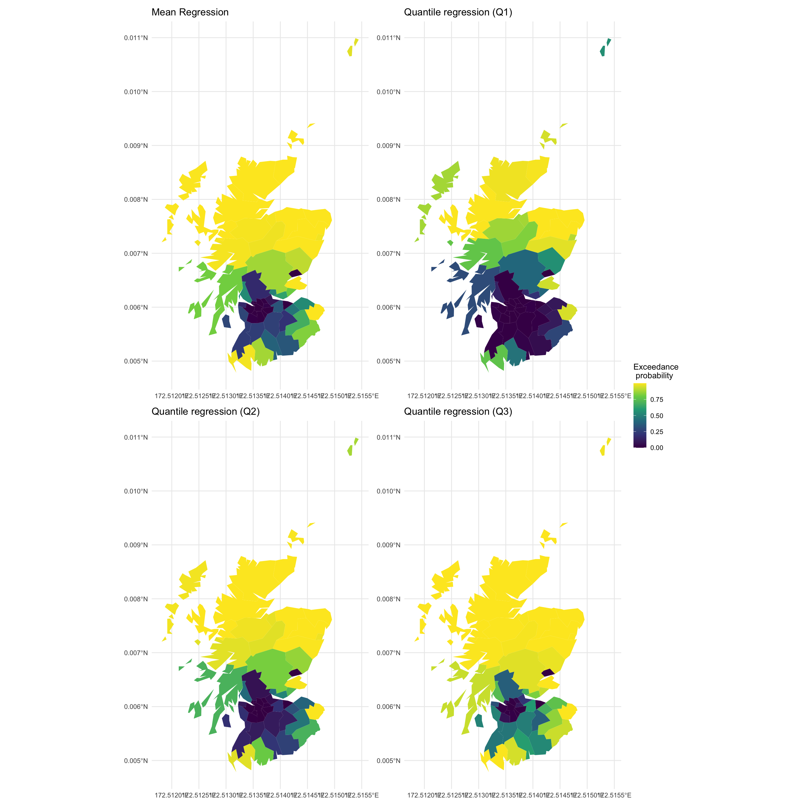
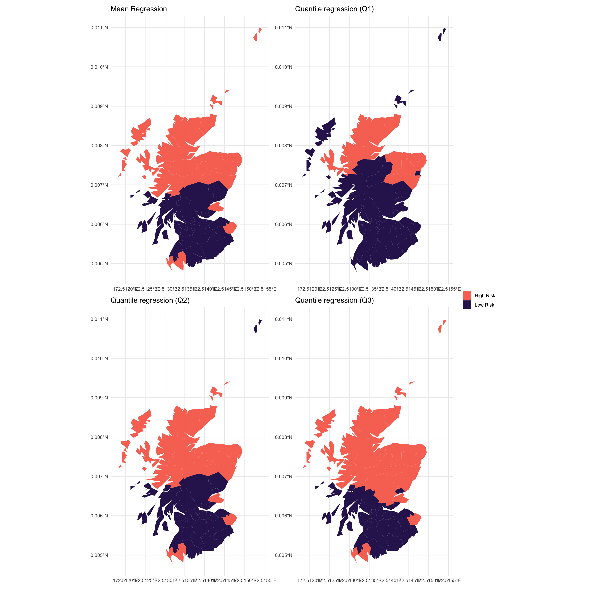

Classical (mean) regression methods model the average behavior, which
despite being an useful summary measure, does not capture how the
covariates may not affect in the same way all levels of population.
Quantile regression allows to quantify the effect of the covariates at
each different quantile level, hence giving us a more complete picture
of the phenomenon in analysis.

While in classical mean regression we would be interested in modeling
conditional expectation 𝔼\[*Y**i*|*X**i*\], thus
analyzing the average behaviour, a Quantile Regression model is
concerned with the behavior of specific classes of interest.

 

Assuming that *Y**i*|*X* is distributed according to some
continuous cumulative distribution function
*F*(*y**i*; *θ**i*), where *θ**i* is
the distribution’s parameter, our procedure can be formalized in two
steps.

1.  **Modeling step**: the quantile of
    *Y**i*|*X**i*,
    *q**i**α* = ℚ*α*(*Y**i*|*X**i*)
    is modeled as
    *q**i**α* = *g*(*η**i*, *α*)
     where *g* is an invertible function chosen by the modeler and
    *η**i*, *α* is the linear predictor, which depends on the
    level *α* of the quantile. No restriction is placed on the linear
    predictor, which can include fixed as well as random effect. Our
    approach is thus flexible enough to include parametric or semi
    parametric models, where the interest may lay in assessing the
    difference in the impact that the covariate may have at different
    levels of the distribution, as well as fully non parametric models,
    where the focus is shifted towards prediction instead.
2.  **Mapping step**: the quantile *q**i**α* is
    mapped to the parameter *θ**i* as
    *θ**i* = *h*(*q**i**α*, *α*)
     where the function *h* must be invertible to ensure the
    identifiability of the model and explicitly depends on the quantile
    level *α*. The map *h* gives us a first interpretation of
    model-based Quantile Regression as a reparametrization of the
    generating likelihood function
    *F*(*y**i*; *θ**i*), in terms of its
    quantiles, i.e.
    *F*(*y**i*; *q**α* = *h* − 1(*θ**i*, *α*)).

 

By linking the quantiles of the generating distribution to its canonical
parameter *θ**i*, we are indirectly modeling
*θ**i* as well, hence we are implicitly building a connection
between Quantile Regression and Generalized Linear (Mixed) Models
(GLMM), which are also concerned with the modeling of *θ**i*.
The modeling and mapping steps in fact, can be considered as a way to
define a link function, in the GLMM sense, as the composition
*θ**i* = *h*(*g*(*η**i*)), and this allows us to
rephrase Quantile Regression as a new link function in a standard GLMM
problem. Drawing a path from GLMM to Quantile Regression is instrumental
in the fitting however the pairing is only formal: coefficients and
random effect have a completely different interpretation.

 

One of the advantages of coupling Quantile Regression to GLMM is that it
allows to bypass slow MCMC methods for the fitting and instead use (Rue
et al. 2017), which allows for both flexibility in the model definition
and efficiency in their fitting. is an package that implements the
`INLA` (Integrated Nested Laplace Approximation, see Rue, Martino, and
Chopin (2009)) method for approximating marginal posterior distributions
for hierarchical Bayesian models, where the latent structure is assumed
to be a Gaussian Markov Random Field, (Rue and Held 2005), which is
especially convenient for computations due to its naturally sparse
representation. The class of model that can be formulated in a
hierarchical fashion is broad enough to include parametric and semi
parametric models; the `INLA` approach is thus extremely flexible and
provides a unified fitting framework for mixed and additive models in
all their derivations.

 

We will now show an example of how to exploit our proposal for Disease
Mapping, using the classical Scottish Lip Cancer example.

    library(INLA)
    ## run the analysis

    library(SpatialEpi)

    ## 
    ## Attaching package: 'SpatialEpi'

    ## The following object is masked _by_ '.GlobalEnv':
    ## 
    ##     scotland_sf

    library(sf)

    ## Linking to GEOS 3.8.1, GDAL 3.2.1, PROJ 7.2.1

    ## data

    library(ggplot2)
    library(patchwork)
    ## visualize the results

    # load the data
    data(scotland)
    head(scotland_sf)

    ## Simple feature collection with 6 features and 13 fields
    ## Geometry type: MULTIPOLYGON
    ## Dimension:     XY
    ## Bounding box:  xmin: 62.03 ymin: 530.297 xmax: 407.583 ymax: 974.961
    ## CRS:           +proj=utm
    ##    county.names cases expected  AFF                       geometry county   ep.mean
    ## 1 skye-lochalsh     9      1.4 0.16 MULTIPOLYGON (((131.769 856...      1 0.9999991
    ## 2        gordon    20      6.6 0.16 MULTIPOLYGON (((397.156 840...      2 0.9999996
    ## 3 western.isles    13      4.4 0.07 MULTIPOLYGON (((123.4395 90...      3 0.9966177
    ## 4    sutherland     5      1.8 0.16 MULTIPOLYGON (((296.841 965...      4 0.9994578
    ## 5         nairn     3      1.1 0.10 MULTIPOLYGON (((294.866 861...      5 0.9903807
    ## 6       wigtown     8      3.3 0.24 MULTIPOLYGON (((246.67 587....      6 0.9884998
    ##       ep.q1     ep.q2     ep.q3   hr.mean     hr.q1     hr.q2     hr.q3
    ## 1 0.9981304 0.9999769 1.0000000 High Risk High Risk High Risk High Risk
    ## 2 0.9998613 0.9999978 1.0000000 High Risk High Risk High Risk High Risk
    ## 3 0.8760350 0.9867102 0.9994494 High Risk  Low Risk High Risk High Risk
    ## 4 0.9814741 0.9981330 0.9998719 High Risk High Risk High Risk High Risk
    ## 5 0.8771234 0.9722964 0.9951651 High Risk  Low Risk High Risk High Risk
    ## 6 0.7611327 0.9625491 0.9972381 High Risk  Low Risk High Risk High Risk

Data (`scotland_sf`) contains the following variables of interest: -
`counts`: number of lip cancer cases among males for the *n* = 56
counties of Scotland between 1975-1980; - `AFF`: proportion of the
population who work in agricultural fishing and farming per county; -
`expected`: expected number of lip cancer cases per county. -
infomations on the adjacency structure

Roughly speaking, in Disease Mapping the goal of the analysis to
identify which areas correspond to a high risk. Standard risk measure,
such as the ratio between observed and expected cases in each area, the
Standardized Mortality (or Morbidity) Ratio (SMR)
*S**M**R* = *c**o**u**n**t**s*/*e**x**p**e**c**t**e**d*, is not reliable
here due to the high variability of expected cases $ expected$, hence is
common practice to introduce a random effect model that exploits the
spatial structure to obtain more stable estimates of the risk.

Assuming that, for each county *i*, conditionally on the covariate
*A**F**F**i* and random effect *b**i*, the
observations are generated by a Poisson distribution
*c**o**u**n**t**s**i*|*A**F**F**i*, *b**i* ∼ Poisson(*λ**i*)

we adopt the following model for the conditional quantile of level *α*
ℚ*α*(*c**o**u**n**t**s**i*|*A**F**F**i*, *b**i*) = *e**x**p**e**c**t**e**d**i* × *θ**i*, *α* = *e**x**p**e**c**t**e**d**i* × exp {*η**i*, *α*}.
 The parameter *θ**i*, *α* corresponding to the
*i**t**h* area can be considered the relative risk of unit
*i* at level *α* of the population. The linear predictor
*η**i*, *α* can be decomposed into
*η**i*, *α* = *β*0 + *β**A**F**F**A**F**F**i* + *b**i*
 where *β*0 represent the overall risk and *b**i*
consists in the sum of an unstructured random effect capturing
overdispersion and measurement errors and spatially structured random
effect. In order to avoid the confounding between the two components of
the random effect and to avoid scaling issues we adopt for
*b* = (*b*1, …, *b**n*) the modified version of
the Besag–York–Mollier (BYM) model introduced in Simpson et al. (2017):
$$
b = \\frac{1}{\\tau\_b}\\left( \\sqrt{1-\\phi} v +\\sqrt{\\phi} u\\right).
$$
 Both random effects are normally distributed, and in particular so that
*b* ∼ *N*(0, *Q**b* − 1) with
*Q**b* − 1 = *τ**b* − 1(1 − *ϕ*)**I** + *ϕ**Q**u* − 1,
a weighted sum of the precision matrix for the **I** and the precision
matrix representing the spatial structure *Q**u*, scaled in
the sense of Sørbye and Rue (2014).

 

In order to fit this model in `INLA`, we start by creating a county
index for the spatial component of the model

    scotland_sf$county <- 1:nrow(scotland_sf)

We then retrieve the adjacency structure to be inputted in the spatially
structured component of the model

    W.nb <- spdep::poly2nb(scotland_sf)

The model specification can be expressed in `INLA` using the following

    formula = cases ~ AFF +  f(county, model = "bym2", graph = W.nb, scale.model = TRUE)

which can be used for both mean and quantile regression.

We now fit mean regression and quantile regression for
*α* = 0.25, 0.5, 0.75.

    # fit mean regression 
    mod.mean = inla(formula,
                    family="poisson",
                    offset = log(expected), 
                    data = scotland_sf, 
                    control.predictor = list(compute= T))

    # fit quantile regression with focus on the first quartile
    mod.q1 = inla(formula,
                  family="poisson", 
                  offset = log(expected), 
                  data = scotland_sf,
                  control.predictor = list(compute= T), 
                  control.family = 
                    list(control.link = list(model = "quantile", quantile = .25)))

    # fit quantile regression with p = 0.5 (median regression)
    mod.q2 = inla(formula,
                  family="poisson", 
                  offset = log(expected), 
                  data = scotland_sf, 
                  control.predictor = list(compute= T), 
                  control.family = 
                    list(control.link = list(model = "quantile", quantile = .5)))

    # fit quantile regression with focus on the third quartile
    mod.q3 = inla(formula,
                  family="poisson", 
                  offset = log(expected), 
                  data = scotland_sf, 
                  control.predictor = list(compute= T), 
                  control.family = 
                    list(control.link = list(model = "quantile", quantile = .75)))

Here are the summaries of the fixed effects (i.e. a summary of the
posterior distribution of *β*0 and *β**A**F**F*)
for the four different models:

    mod.mean$summary.fixed

    ##                   mean        sd 0.025quant   0.5quant 0.975quant       mode
    ## (Intercept) -0.3175209 0.1257992 -0.5666606 -0.3170789 -0.0712285 -0.3163381
    ## AFF          4.5483499 1.3161428  1.9141415  4.5632401  7.0989976  4.5936403
    ##                      kld
    ## (Intercept) 5.958045e-06
    ## AFF         1.765281e-05

    mod.q1$summary.fixed

    ##                   mean       sd 0.025quant   0.5quant 0.975quant      mode
    ## (Intercept) -0.6981403 0.140725 -0.9795716 -0.6966481 -0.4254054 -0.693893
    ## AFF          4.5372458 1.446980  1.6333443  4.5568246  7.3316071  4.596766
    ##                      kld
    ## (Intercept) 8.305425e-06
    ## AFF         1.819463e-05

    mod.q2$summary.fixed

    ##                   mean        sd 0.025quant   0.5quant 0.975quant       mode
    ## (Intercept) -0.4213373 0.1298763 -0.6792806 -0.4206045 -0.1678408 -0.4192963
    ## AFF          4.5853834 1.3493990  1.8796730  4.6025606  7.1947982  4.6375294
    ##                      kld
    ## (Intercept) 8.777387e-06
    ## AFF         2.306930e-05

    mod.q3$summary.fixed

    ##                   mean        sd 0.025quant   0.5quant 0.975quant       mode
    ## (Intercept) -0.1819145 0.1253372 -0.4302945 -0.1814253 0.06335245 -0.1805943
    ## AFF          4.6218467 1.3059722  2.0090784  4.6362018 7.15407394  4.6655898
    ##                      kld
    ## (Intercept) 4.401287e-06
    ## AFF         1.652881e-05

Here are the summaries of the hyperparameters effects (i.e. a summary of
the posterior distribution of *τ**b* and *ϕ*) for the four
different models:

    mod.mean$summary.hyperpar

    ##                           mean        sd 0.025quant  0.5quant 0.975quant      mode
    ## Precision for county 4.2772896 1.4066479  2.1673669 4.0610573  7.6222367 3.6634363
    ## Phi for county       0.7771857 0.1771613  0.3430912 0.8228827  0.9868951 0.9668143

    mod.q1$summary.hyperpar

    ##                           mean        sd 0.025quant  0.5quant 0.975quant      mode
    ## Precision for county 4.2840445 1.5713168   2.006944 4.0196607  8.0932009 3.5428167
    ## Phi for county       0.8335798 0.1596781   0.407227 0.8860204  0.9948228 0.9908636

    mod.q2$summary.hyperpar

    ##                           mean        sd 0.025quant  0.5quant 0.975quant      mode
    ## Precision for county 4.3311978 1.4672782  2.1520430 4.0996414  7.8456250 3.6761671
    ## Phi for county       0.8078834 0.1720865  0.3651976 0.8601835  0.9929848 0.9866981

    mod.q3$summary.hyperpar

    ##                           mean        sd 0.025quant  0.5quant 0.975quant      mode
    ## Precision for county 4.2407629 1.3795181   2.154371 4.0347676  7.5144924 3.6534992
    ## Phi for county       0.7689859 0.1795067   0.331693 0.8136253  0.9854329 0.9615743

The relative risk *θ**i*, *α* can be used to detect “high
risk” areas, typically by means of exceedance probabilities. Given a
generic Mean Regression model

𝔼\[*Y**i*|*X**i*, *b**i*\] = *E**i**θ* = *E**i*exp {*η**i*}.

posterior probability of the risk *θ* exceeding some value are used to
assess whether an area has high risk or not. Typically the
*i**t**h* area is considered to be of high risk if
ℙ(*θ**i* &gt; 1|*Y*1, …*Y**n*) &gt; *t*
where *t* is a threshold value depending on the application. This
naturally extends to the Quantile Regression case, in the sense that for
a model
ℚ*α*(*Y**i*|*X**i*, *b**i*) = *E**i**θ**i*, *α* = *E**i*exp {*η**i*}.
 we can define the exceedence probability as
ℙ(*θ**i* &gt; 1|*Y*1, …*Y**n*)
 and define an area at “high risk” if
ℙ(*θ**i*, *α* &gt; 1|*Y*1, …*Y**n*) &gt; *t*.

 

In `INLA` we can compute exceedence probability as follows.

    # marginal of linear predictor
    csi.mean <- mod.mean$marginals.linear.predictor[1:nrow(scotland_sf)] # - 

    ### Notice that in the INLA call we use log(expected) as offset, hence the linear predictor contains the expected as well

    # exceedance probability
    ep.mean <- c()
    for(i in 1:length(csi.mean)){
      ep.mean[i] <- {1 - inla.pmarginal(log(scotland_sf$expected[i]), csi.mean[[i]])}
    }
    # where the log(expected) is now accounted when computing the exceedance prob

Analogously for Quantile models.

    csi.q1 <- mod.q1$marginals.linear.predictor[1:nrow(scotland_sf)]

    # compute excedence probability for first quartile
    ep.q1 <- c()
    for(i in 1:length(csi.q1)){
      ep.q1[i] <- {1 - inla.pmarginal(log(scotland_sf$expected[i]), csi.q1[[i]])}
    }

    csi.q2 <- mod.q2$marginals.linear.predictor[1:nrow(scotland_sf)]

    # compute excedence probability for second quartile (median)
    ep.q2 <- c()
    for(i in 1:length(csi.q2)){
      ep.q2[i] <- {1 - inla.pmarginal(log(scotland_sf$expected[i]), csi.q2[[i]])}
    }

    csi.q3 <- mod.q3$marginals.linear.predictor[1:nrow(scotland_sf)]

    # compute excedence probability for third quartile
    ep.q3 <- c()
    for(i in 1:length(csi.q3)){
      ep.q3[i] <- {1 - inla.pmarginal(log(scotland_sf$expected[i]), csi.q3[[i]])}
    }

Let’s visualize the results, starting from exceedance probabilities:

    scotland_sf$ep.mean <- ep.mean
    scotland_sf$ep.q1 <- ep.q1
    scotland_sf$ep.q2 <- ep.q2
    scotland_sf$ep.q3 <- ep.q3

    mean_exprob <- ggplot(scotland_sf, aes(fill = ep.mean)) + geom_sf(color = NA) + theme_minimal()  + labs(fill = "Exceedance\n probability")
    q1_exprob <- ggplot(scotland_sf, aes(fill = ep.q1)) + geom_sf(color = NA) + theme_minimal()  + labs(fill = "Exceedance\n probability")
    q2_exprob <- ggplot(scotland_sf, aes(fill = ep.q2)) + geom_sf(color = NA) + theme_minimal()  + labs(fill = "Exceedance\n probability")
    q3_exprob <- ggplot(scotland_sf, aes(fill = ep.q3)) + geom_sf(color = NA) + theme_minimal()  + labs(fill = "Exceedance\n probability")

    mean_exprob + ggtitle("Mean Regression" ) +  q1_exprob + ggtitle("Quantile regression (Q1)") +  
      q2_exprob + ggtitle("Quantile regression (Q2)") +  q3_exprob + ggtitle("Quantile regression (Q3)") +
      plot_layout( guides = "collect", nrow = 2, byrow = T) &   scale_fill_viridis_c() 

And let us find areas of high risk, assuming the critical threshold
*t* = 0.95

    scotland_sf$hr.mean <- factor(ep.mean > 0.95, levels = c(TRUE, FALSE), labels = c("High Risk", "Low Risk"))
    scotland_sf$hr.q1 <-  factor(ep.q1 > 0.95, levels = c(TRUE, FALSE), labels = c("High Risk", "Low Risk"))
    scotland_sf$hr.q2 <-  factor(ep.q2 > 0.95, levels = c(TRUE, FALSE), labels = c("High Risk", "Low Risk"))
    scotland_sf$hr.q3 <-  factor(ep.q3 > 0.95, levels = c(TRUE, FALSE), labels = c("High Risk", "Low Risk"))

    mean_hra <- ggplot(scotland_sf, aes(fill = hr.mean)) + geom_sf(color = NA) + theme_minimal() + labs(fill = "")

    q1_hra <- ggplot(scotland_sf, aes(fill = hr.q1)) + geom_sf(color = NA) + theme_minimal() + labs(fill = "")

    q2_hra <- ggplot(scotland_sf, aes(fill = hr.q2)) + geom_sf(color = NA) + theme_minimal() +  labs(fill = "")

    q3_hra <- ggplot(scotland_sf, aes(fill = hr.q3)) + geom_sf(color = NA) + theme_minimal() + labs(fill = "")

    mean_hra + ggtitle("Mean Regression" ) +  q1_hra + ggtitle("Quantile regression (Q1)") +  
      q2_hra + ggtitle("Quantile regression (Q2)") +  q3_hra + ggtitle("Quantile regression (Q3)") +
      plot_layout( guides = "collect", nrow = 2, byrow = T) &   scale_fill_viridis_d(option = "A", alpha =0.96, begin = 0.15, end = 0.7, direction = -1)

Figures show the critical areas identified by quantile and mean
regression. The similarity of the results of our method with those
corresponding to a more traditional approach, as well as to previous
analyses, reassures us that our method yields reasonable results. At the
same time, the minor discrepancies between the two maps is also
encouraging, as the two methods have different definitions of high risk;
different results correspond in fact to different insights on the
disease risk and the non-overlap between quantile-based exceedance
probability-based methods testifies that there is information to be
gained from our approach.

Rue, Håvard, and Leonhard Held. 2005. *Gaussian Markov Random Fields
Theory and Applications*. CRC press.

Rue, Håvard, Sara Martino, and Nicolas Chopin. 2009. “Approximate
Bayesian inference for latent Gaussian models by using integrated nested
Laplace approximations.” *Journal of the Royal Statistical Society.
Series B (Statistical Methodology)* 71 (2): 319–92.

Rue, Håvard, Andrea Riebler, Sigrunn H Sørbye, Janine B Illian, Daniel P
Simpson, and Finn K Lindgren. 2017. “Bayesian Computing with INLA : A
Review.” *Annual Review of Statistics and Its Application* 4: 395–421.

Simpson, Daniel, Håvard Rue, Andrea Riebler, Thiago G Martins, and
Sigrunn Holbek Sørbye. 2017. “Penalising model component complexity: A
principled, practical approach to constructing priors.” *Statistical
Science* 32 (1): 1–28.

Sørbye, Sigrunn Holbek, and Håvard Rue. 2014. “Scaling intrinsic
Gaussian Markov random field priors in spatial modelling.” *Spatial
Statistics* 8: 39–51.
